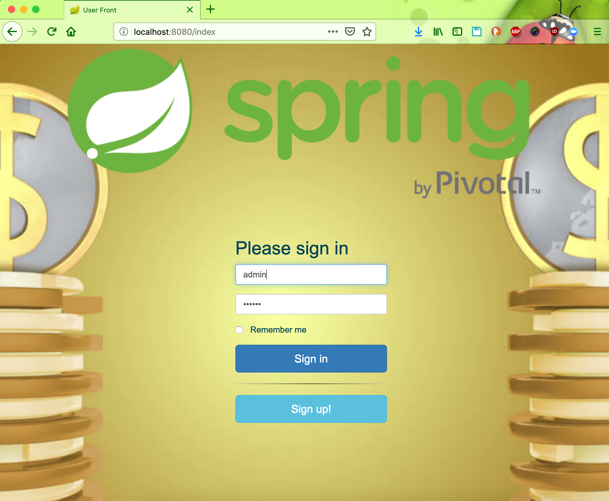
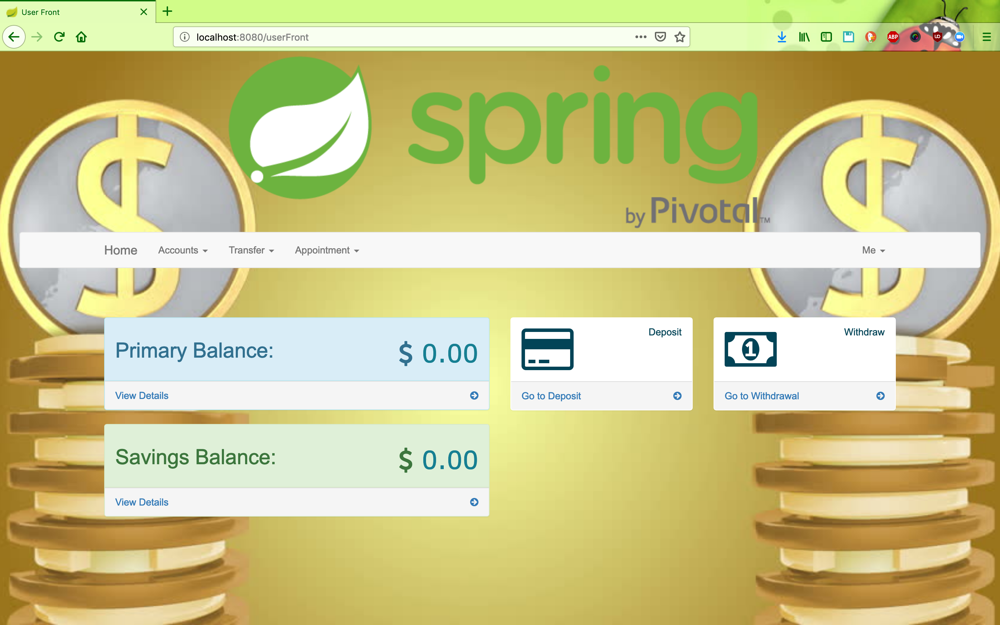
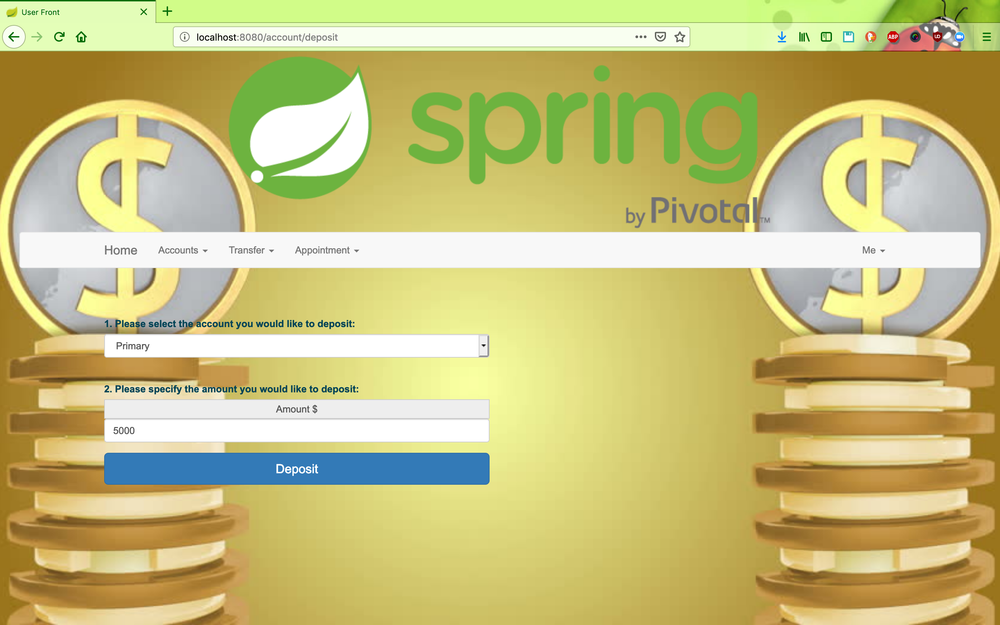

# Online-banking-angular-springboot-mysql

Online-Bank-Simulator

Spring Boot/Spring Data/Spring Security/Hibernate/MySQL/REST

The project simulates online banking system. It allows to register/login, deposit/withdraw money from accounts, add/edit recipients, transfer money between accounts and recipients, view transactions, make appointments.

There are two roles user and admin.

## Thing to run the application

__Clone the repository__
```
git clone https://github.com/hendisantika/Online-banking-angular-springboot-mysql 
```

__Go the folder__
```
Online-banking-angular-springboot-mysql
```

__Set Your MySQL username & password in application.properties__

[application.properties](../../blob/master/src/main/resources/application.properties)

__Run the application__
```
mvn clean spring-boot:run
```

## Screen shot 

### Sign Up Page


### Sign In Page



### Dashboard Page



### Deposit Page



### Dashboard Page   


## Spring Boot/Spring Data/Spring Security/Hibernate/MySQL/REST

The project simulates online banking system. It allows to register/login, deposit/withdraw money from accounts, add/edit recipients,
transfer money between accounts and recipients, view transactions, make appointments.

There are two roles user and admin. 

The admin has there own frontend implemented in Angular2, which communicates with backend through REST services.

## Deployment Steps on Docker:
###### Download application
```
git clone https://github.com/hendisantika/online-banking.git
```
###### Start MySQL Docker Container
```
docker run --detach --name=bankmysql --env="MYSQL_ROOT_PASSWORD=root" -p 3306:3306 mysql:8
```
###### Run Docker image of the application
```
docker run --detach -p 8888:8888 --link bankmysql:localhost -t hendisantika/online-banking:latest
```
Access the application by clicking the URL "[http://localhost:8080!](http://localhost:8080)"

## Deployment Steps without Docker:
###### Build application
```
mvn clean build
```
###### DB Setup
 * Start [MySQL server!](https://dev.mysql.com/downloads/mysql/)
 * Use [MySQLWorkbench!](https://www.mysql.com/products/workbench/)

###### Run application
```
java -jar target/online-banking-0.0.1-SNAPSHOT.jar
```

## Things to know:
###### Build Docker image for the application
```
docker build -t hendisantika/online-banking:latest .
```
###### Create Jenkins image that has Maven
```
sudo chmod 777 /var/run/docker.sock && \
mkdir -p /jenkins_bkp/jenkins_home && \
chmod -R 777 /jenkins_bkp && \
git clone https://github.com/hendisantika/online-banking.git && \
cd online-bank && \
git checkout master && \
cp Dockerfile-Jenkins-Maven ../Dockerfile && \
cd .. && \
docker build -t hendisantika/jenkins-maven-docker:v0.1 .
```
###### Start Jenkins Server on Docker
```
docker run --detach -v /var/run/docker.sock:/var/run/docker.sock -v $(which docker):$(which docker) -p 9080:8080 -p 50000:50000 -v /jenkins_bkp/jenkins_home:/var/jenkins_home hendisantika/jenkins-maven-docker:v0.1
```
###### Setup "online-banking" project in Jenkins:
 * Login to Jenkins and setup a pipeline project with source code from [Link to OnlineBank GIT repo!](https://github.com/hendisantika/online-banking.git)
 * Run the job to build and deploy the application

###### Debug H2 DB while testing
 * Set a debug point in any test step and check the URL "http://localhost:8080/console" while testing

